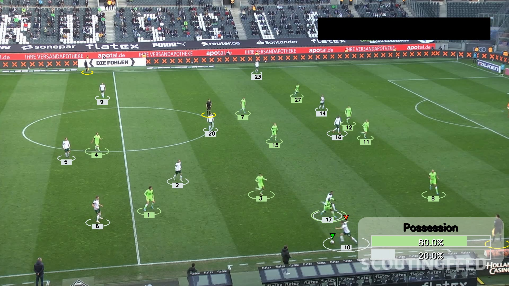

# **Football Player & Ball Tracking with YOLOv5**  

This project uses a custom-trained **YOLOv5** model to detect and track **players, referees, and the ball** in football match footage. It employs **ByteTrack** for object tracking, assigns different colors to teams, and provides visual annotations to analyze gameplay effectively.  

## **🚀 Features**  

✅ **Player, Referee & Ball Detection** – Identifies all key entities in a football match.  
✅ **Object Tracking with ByteTrack** – Maintains player identities across frames.  
✅ **Team Color Assignment** – Differentiates teams visually for better analysis.  
✅ **Visual Annotations** – Overlays bounding boxes and tracking IDs.  
✅ **Efficient Batch Processing** – Optimized for real-time or near real-time performance.
✅ **Improve team classification** - Using jersey color detection 

---


## **📥 Installation**  

### **1️⃣ Clone the Repository**  
```bash
git clone https://github.com/Oizys13/Football-Analysis.git
cd Football-Analysis
```

### **2️⃣ Install Dependencies**  
```bash
pip install -r requirements.txt
```

### **3️⃣ Download YOLOv5 Model Weights**  
Place your trained YOLOv5 model (`.pt` file) inside the `model/` folder.  

---

## **🛠 Usage**  

Modify the following code inside your script to run the object tracking system:  

```python
# Read video
video_frames = read_video('assets/vid3.mp4')

# Create tracker
tracker = Tracker('model/best.pt')

# Track video
tracks = tracker.getObjectTracks(
    video_frames,
    read_from=True,
    path='stubs/track_stubs_gk.pkl'
)
```

### **Explanation**  
- **`read_video('assets/vid3.mp4')`** – Reads the input video file. Change the path to your own video.  
- **`Tracker('model/best.pt')`** – Loads the trained YOLOv5 model for detection.  
- **`getObjectTracks(video_frames, read_from=True, path='stubs/track_stubs_gk.pkl')`**  
  - If `read_from=True`, it loads pre-saved tracking data from a pickle file instead of reprocessing the video.  
  - Change the `path` to match your dataset or set `read_from=False` to process from scratch.  

---

## **🎯 How It Works**  

1. **Load the YOLOv5 Model** – Detects players, referees, and the ball.  
2. **Track Objects with ByteTrack** – Assigns unique IDs to each player and maintains tracking across frames.  
3. **Assign Team Colors** – Differentiates players into two teams based on tracking heuristics.  
4. **Draw Annotations** – Overlays bounding boxes, tracking IDs, and team color indicators.
5. **Calculate Ball Possession Stats** - Identify ball holder in each frame and calucate possession percentage for each team.  
6. **Save Processed Video** – Outputs the annotated match footage.  

---

## **📌 Example Output**  

| Processed Frame |
|----------------|
|  |


---

If you have any questions or suggestions, feel free to reach out!  

